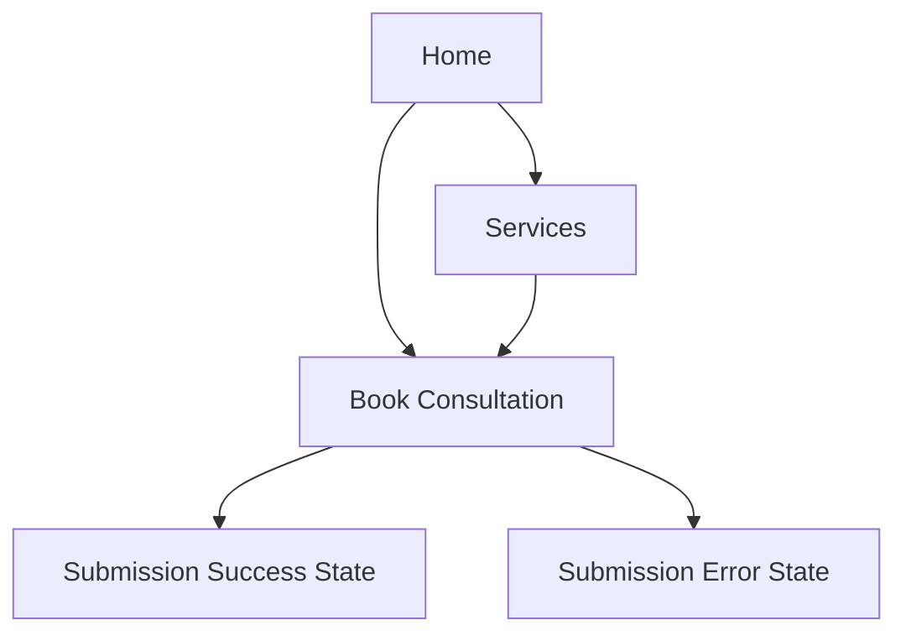

## 1. Product Overview
SAMARTH ASSOCIATE’s website redesign into a premium, futuristic, high-conversion advisory brand presence.
The site’s primary goal is to turn qualified visitors into consultation bookings while building trust and authority.

## 2. Core Features

### 2.1 Feature Module
Our website requirements consist of the following main pages:
1. **Home**: premium hero + value proposition, proof/trust, service overview, primary CTA to book.
2. **Services**: clear service offerings, outcomes, process, FAQs, secondary CTAs to book.
3. **Book Consultation**: lead-capture form + scheduling intent, confirmation state.

### 2.3 Page Details
| Page Name | Module Name | Feature description |
|---|---|---|
| Home | Brand header (navbar) | Display logo + brand name, primary navigation, persistent “Book Consultation” CTA button. |
| Home | Hero (high-conversion) | Present 1-line positioning, 2–3 key outcomes, primary CTA to booking route, supporting trust microcopy. |
| Home | Trust & proof | Show credibility blocks (client logos/testimonials/metrics placeholders), compliance-friendly disclaimers if needed. |
| Home | Service preview | Summarize 3–6 core services as cards with “Learn more” deep links. |
| Home | Conversion section | Reinforce outcomes, show simple 3-step engagement process, final CTA. |
| Home | Footer | Show logo, compact nav, contact placeholders, legal text placeholder. |
| Services | Service catalog | List services with who-it’s-for, deliverables, expected outcomes, and engagement format. |
| Services | Process timeline | Explain “How we work” steps (discovery → analysis → recommendation → execution support). |
| Services | FAQs | Answer common objections; keep content concise and scannable. |
| Services | CTA rails | Repeat “Book Consultation” CTA and quick contact snippet. |
| Book Consultation | Lead form | Capture name, email, phone (optional), company (optional), service interest, message; validate and submit. |
| Book Consultation | Submission states | Show loading/success/error states; provide next-step instructions after success. |
| Global | Logo usage | Use provided logo in navbar, favicon, footer, and animated loading screen/route transition overlay. |
| Global | Motion system | Use Framer Motion for section reveals, hover micro-interactions, and page transitions without harming readability/performance. |

## 3. Core Process
**Visitor Flow (conversion-first)**
1. You land on Home and immediately understand SAMARTH ASSOCIATE’s positioning and key outcomes.
2. You scroll through trust signals and a clear snapshot of services.
3. You click “Book Consultation” (from navbar/hero/CTA sections).
4. You submit the consultation request form and receive a confirmation state with next steps.
5. If you want more detail, you review Services and then book.

