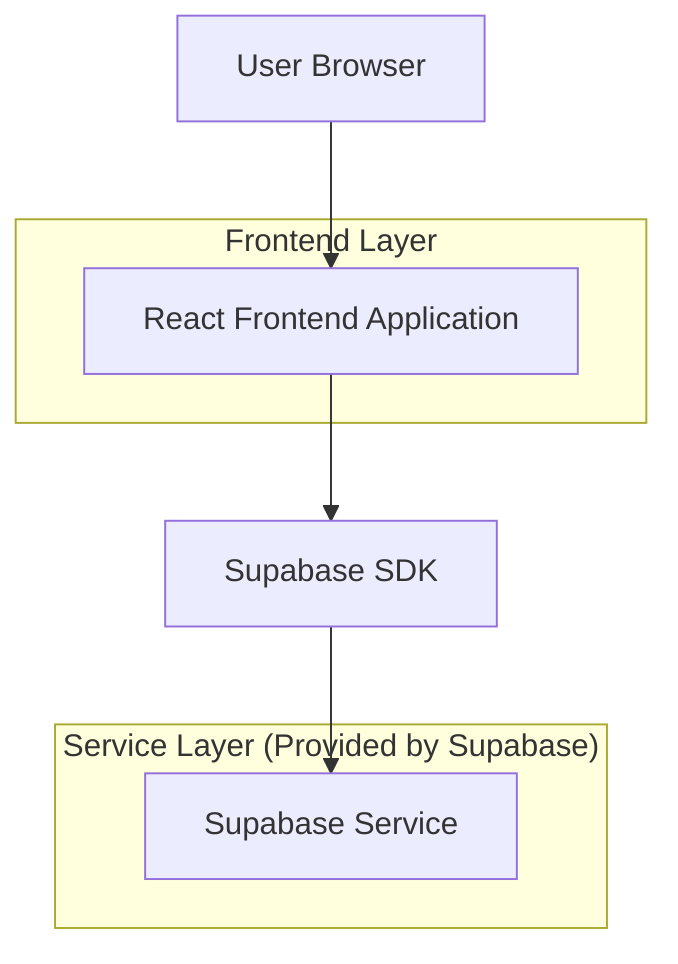
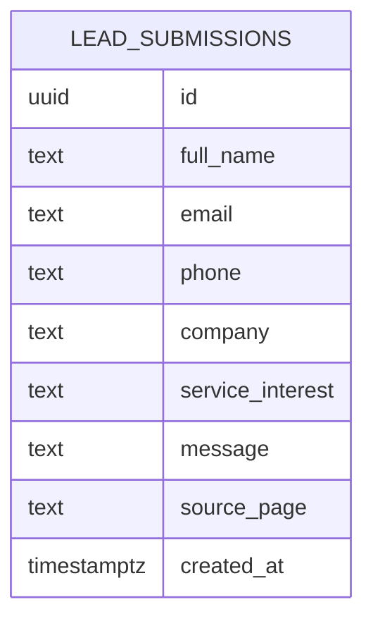

## 1.Architecture design


## 2.Technology Description
- Frontend: React@18 + tailwindcss@3 + FramerMotion + react-router-dom
- Backend: Supabase (PostgreSQL) for consultation lead capture (no custom server)

## 3.Route definitions
| Route | Purpose |
|---|---|
| / | Home page with premium positioning + primary conversion CTA |
| /services | Service offerings, process, FAQs, CTAs |
| /book | Consultation booking / lead-capture form |

## 6.Data model(if applicable)

### 6.1 Data model definition


### 6.2 Data Definition Language
Lead Submissions Table (lead_submissions)
```
CREATE TABLE lead_submissions (
  id UUID PRIMARY KEY DEFAULT gen_random_uuid(),
  full_name TEXT NOT NULL,
  email TEXT NOT NULL,
  phone TEXT,
  company TEXT,
  service_interest TEXT,
  message TEXT,
  source_page TEXT,
  created_at TIMESTAMPTZ NOT NULL DEFAULT NOW()
);

-- Enable Row Level Security
ALTER TABLE lead_submissions ENABLE ROW LEVEL SECURITY;

-- Allow public (anon) to create leads only
CREATE POLICY "anon_can_insert_leads"
ON lead_submissions
FOR INSERT
TO anon
WITH CHECK (true);

-- Allow authenticated users to read/manage (internal admin use)
CREATE POLICY "authenticated_full_access"
ON lead_submissions
FOR ALL
TO authenticated
USING (true)
WITH CHECK (true);
```
